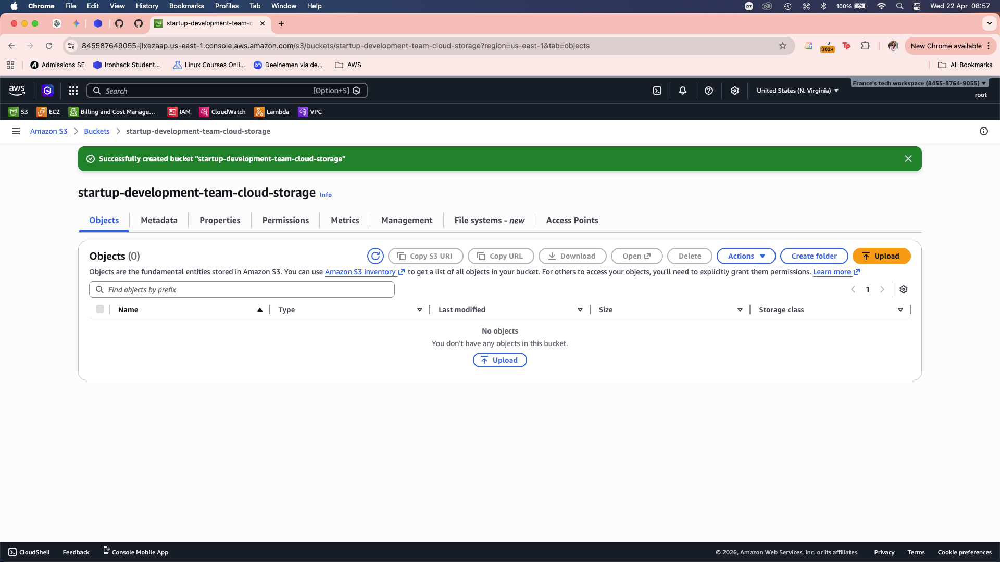
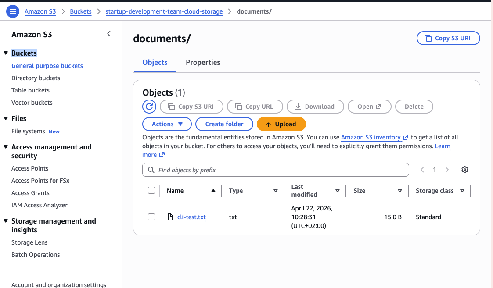
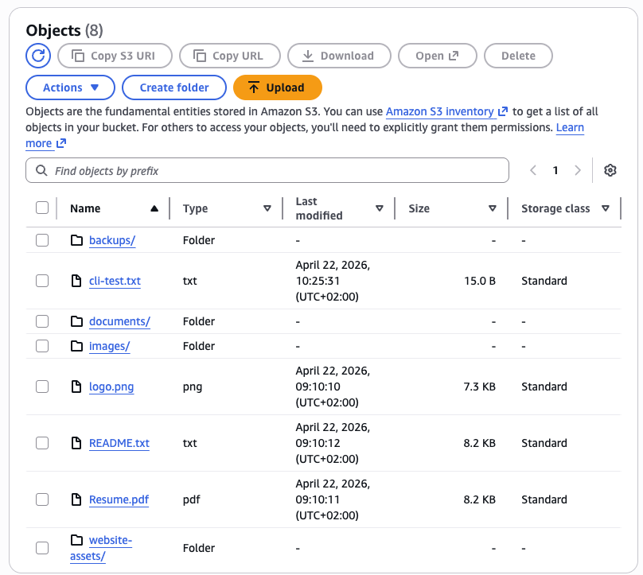
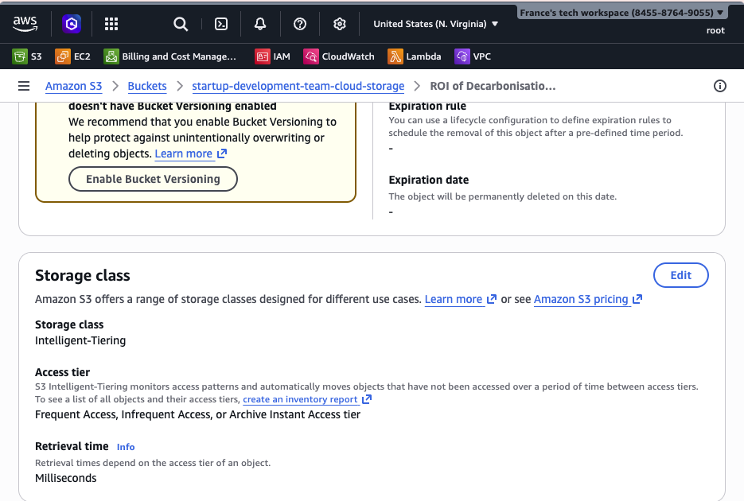
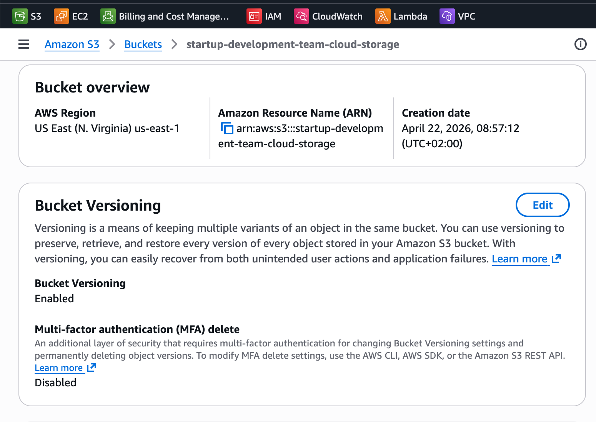
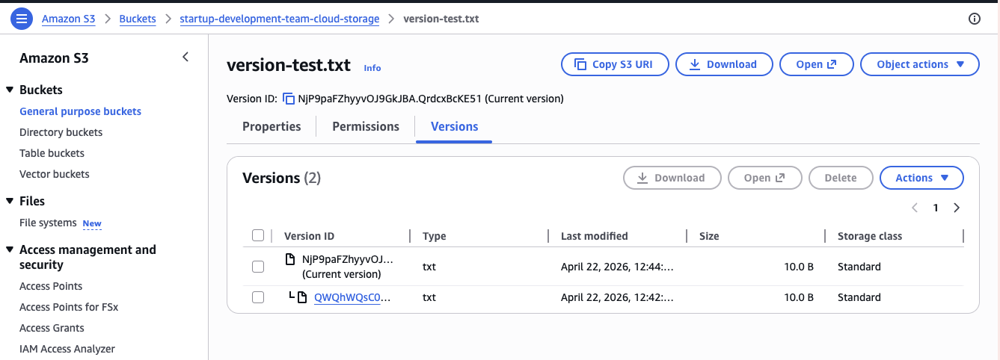
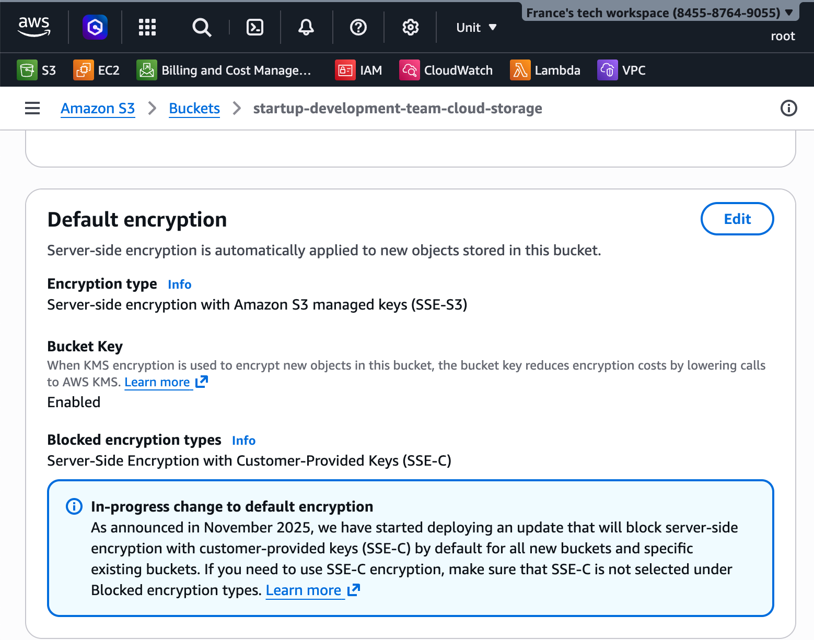
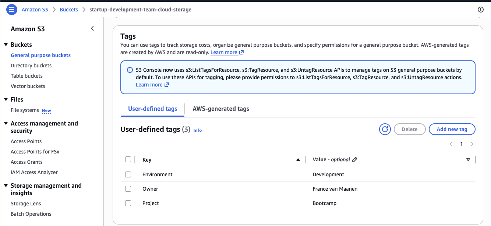
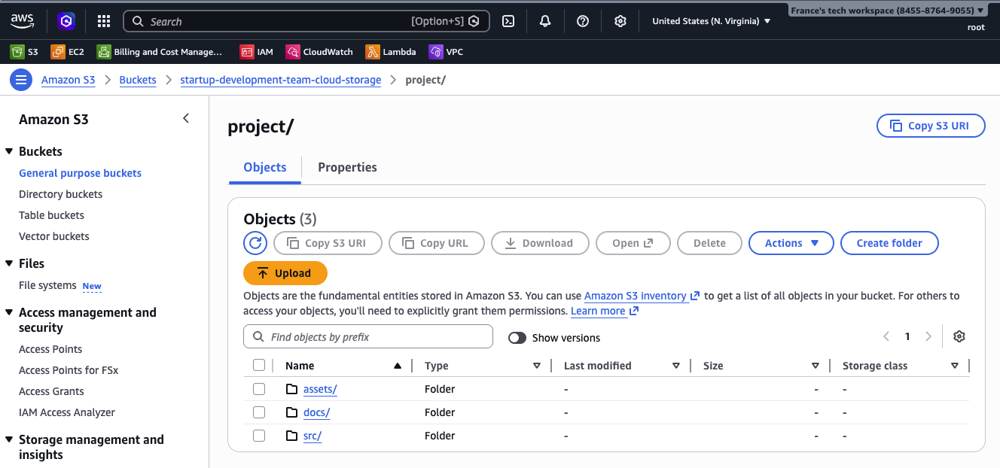
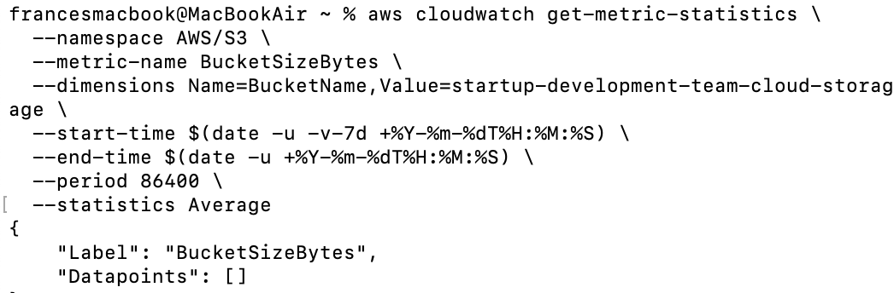

# Create S3 Bucket Lab - Solution

**Student Name:** France van Maanen
**Date:** 22 April 2026

---

## Exercise 1: Bucket Creation

**Bucket Name:** [your-name-bootcamp-demo-2024]  
**Region:** [us-east-1]

---

## Exercise 2: Object Uploads

### Files Uploaded:
1. [File 1 name and type]
2. [File 2 name and type]
3. [File 3 name and type]

### Folder Structure:

**Folders Created:**
- images/
- documents/
- backups/

---

## Exercise 3: Storage Classes

**Storage Classes Used:**
- Standard: [Number] objects
- Standard-IA: [Number] objects
- Intelligent-Tiering: [Number] objects

---

## Exercise 4: Bucket Features

### Versioning:

**Number of versions created:** [X]

### Encryption:

**Encryption type:** SSE-S3

### Tags:

**Tags Added:**
- Environment: Development
- Project: Bootcamp

---

## Exercise 5: Download/Delete

**Operations Completed:**
- [x] Downloaded object via console
- [x] Downloaded object via CLI
- [x] Deleted object via console
- [x] Deleted object via CLI

---

## Exercise 6: Sync Operations

**Files Synced:** [Number]  
**Total Size:** [Size]

---

## Exercise 7: Metrics

**Bucket Statistics:**
- Total objects: [X]
- Total size: [X GB]
- Storage class distribution: [Details]

---

## Bonus Challenges

### Lifecycle Policy:

**Policy Rules:**
- [x] Transition to Standard-IA: 30 days
- [x] Transition to Glacier: 90 days
- [x] Delete: 365 days

---

## CLI Outputs

See `cli-outputs.txt` for all command outputs.

---

## Reflection

**What did you learn about S3?**
[Your answer]

**When would you use different storage classes?**
[Your answer]

---

## Checklist

- [ ] Bucket created
- [ ] Objects uploaded (console and CLI)
- [ ] Folders created
- [ ] Storage classes configured
- [ ] Versioning enabled and tested
- [ ] Encryption enabled
- [ ] Tags added
- [ ] Sync completed
- [ ] All screenshots captured
- [ ] Bucket cleaned up (deleted)

**Completed By:** [Your Name]
